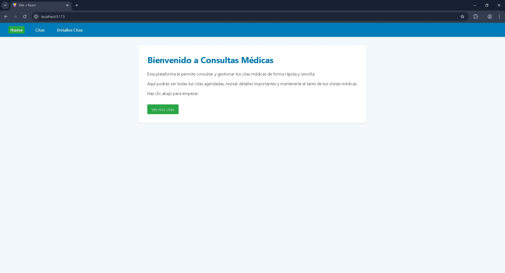
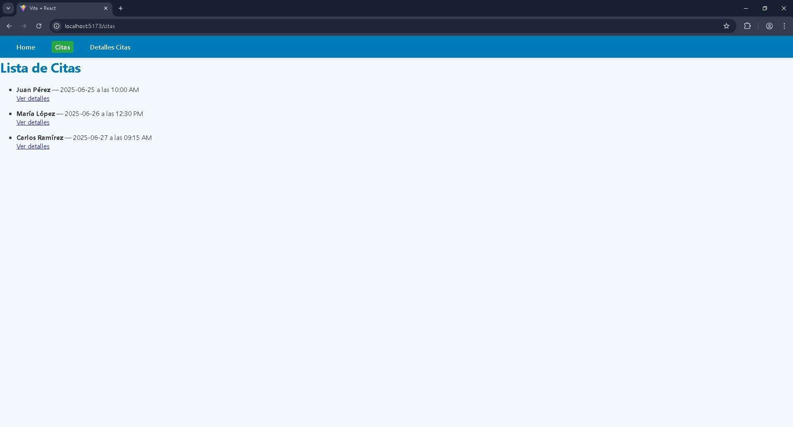
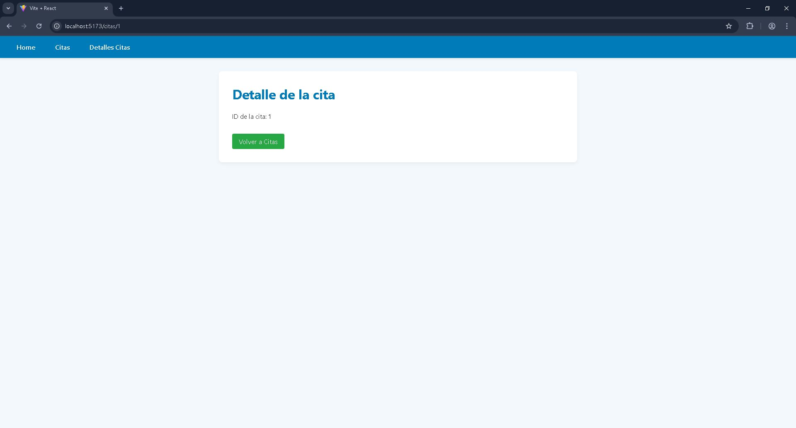

# 🩺 Página de Citas Médicas — React

Este proyecto es una aplicación web hecha con **React** que permite visualizar una lista de citas médicas y ver el detalle de cada una. Tiene navegación entre páginas gracias a **React Router**.

## 🔧 Funcionalidades principales

- Vista principal con lista de citas médicas.
- Navegación entre páginas usando `react-router-dom`.
- Página de detalle para cada cita.
- Mensaje si no se ha seleccionado ninguna cita.
- Página 404 para rutas no válidas.
- Barra de navegación con rutas activas.

## 📸 Capturas de pantalla

### 🏠 Página de inicio



### 📅 Lista de citas



### 👤 Detalle de una cita (Se seleccionó la 1ra cita)



### ⚠️ Sin cita seleccionada


## 🛠 Tecnologías utilizadas

- React
- React Router DOM
- CSS

## 🚀 Cómo ejecutar

1. Instala las dependencias:

   ```bash
   npm install

   ```

2. Inicia el servidor de desarrollo:
   ```bash
   npm run dev
   ```
